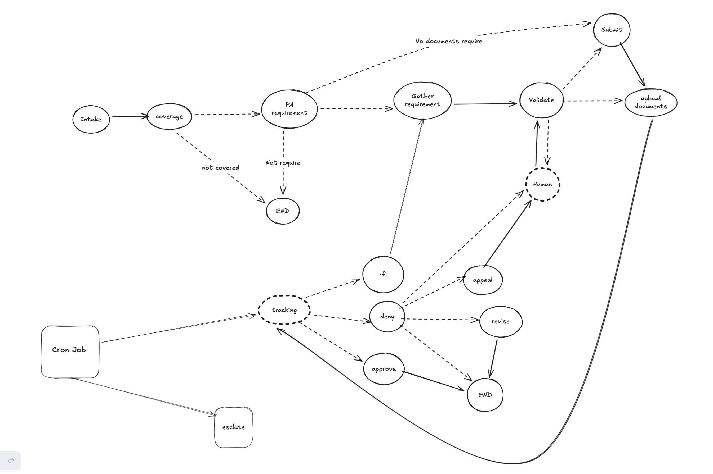
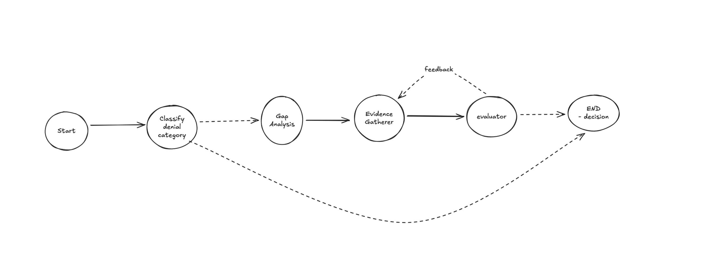

# Prior Authorization Agent - Design Documentation

## Overview

A Prototype that automates healthcare prior authorization workflows.

## Architecture



### How to Run

I have added a runner and some mock PA intake data to execute the workflow. Refer to `src/intake_scenario.py`. It has three scenarios `Scenario A: MRI Lumbar Spine`, `Scenario B: biologic medication` and `Scenario C: Denial`.

To run the workflow, execute the following command:

```bash
python -m src.main <intake_id>
```
For example, to run scenario A, execute `python -m src.main PA-SCENARIO-A`

## Core Components

### 1. Main Workflow (`src/agent/workflow.py`)

State machine with 12 nodes orchestrating the PA lifecycle:

| Node | Purpose |
|------|---------|
| `intake` | Transforms intake form into agent state |
| `determine_coverage` | Fetches patient coverage via EHR/payer APIs |
| `pa_requirement_discovery` | Checks if PA required, gets documentation requirements |
| `gather_pa_requirement` | Delegates to Requirement Agent for document collection |
| `validate_requirements` | Validates completeness, creates HITL tasks for gaps |
| `submission` | Submits PA request to payer |
| `tracking` | Monitors submission status (async polling) |
| `denial` | Delegates to Denial Evaluation Agent |
| `appeal` | Drafts appeal letter via LLM, creates HITL for approval |
| `revise` | Handles resubmission path |
| `rfi` | Processes Request for Information from payer |
| `human_intervention` | Pauses workflow for HITL task completion |

### 2. Requirement Agent (`src/agent/requirement/`)

Sub-graph for parallel document gathering:

```
parse_requirement → [parallel: process_requirement_item × N] → output
                           ↓
              ┌────────────┴────────────┐
              │   Gatherer Subgraph     │
              │  gather → tools → eval  │
              └─────────────────────────┘
```

- Parses requirements into structured items
- Spawns parallel gatherer agents per item
- Each gatherer: searches EHR/documents → evaluates completeness
- Aggregates results with gap analysis

### 3. Denial Evaluation Agent (`src/agent/denial/`)

Sub-graph for denial analysis and recommendation:



| Node | Function |
|------|----------|
| `categorize` | Classifies denial (medical necessity, missing docs, coding error, etc.) |
| `gap_analyst` | Identifies evidence gaps, creates search plan |
| `evidence_gatherer` | Collects supporting evidence via tools |
| `reasoner` | Recommends action: APPEAL / REVISE_AND_RESUBMIT / FINAL_DENIAL |

## Tools

| Tool | Purpose |
|------|---------|
| `search_patient_documents` | Search patient document repository |
| `get_patient_health_record` | Fetch EHR data (labs, vitals, history) |
| `get_procedure_details` | Medical procedure information |
| `get_drug_coverage_details` | Drug formulary/coverage lookup |
| `check_step_therapy_requirements` | Step therapy protocol validation |
| `validate_codes` | CPT/HCPCS/ICD-10 code validation |
| `lookup_policy_criteria` | Payer policy criteria lookup |

## Human-in-the-Loop (HITL)

Workflow pauses and creates tasks for:
- Missing required documentation
- Appeal letter review/approval
- Ambiguous denial responses (low confidence)
- Technical escalations (submission failures)

Task types: `REQUIRE_DOCUMENTS`, `APPEAL_REVIEW`, `AMBIGUOUS_RESPONSE`, `TECHNICAL_ESCALATION`

## Mock Async Services

### PA Status Poller (`src/pa_status_poller.py`)
- Polls payer API for submission status changes
- Resumes workflow on status change (APPROVED/DENIED/RFI)

### HITL Task Poller (`src/hitl_task_poller.py`) -> should be trigger by some API in real scenario
- Monitors HITL task completion
- Updates state and resumes workflow


## Some Considerations

### Confidence Thresholds
- Denial evaluation uses confidence threshold for auto-routing
- Below threshold → HITL escalation (ambiguous cases need human judgment)
- Appeal strength score (0-100) helps clinicians prioritize review effort

### Evidence Grounding
- All LLM outputs must cite gathered evidence (no hallucination)
- Structured outputs (`with_structured_output`) enforce schema compliance
- Tools return raw data; LLM interprets but cannot invent facts

### Retry & Error Handling
- Pollers use exponential backoff (2^n seconds)
- Submission failures create HITL tasks rather than silent retry. For retry, we would use idempotency key to ensure no duplicate submission
- `max_retries=3` on LLM calls with timeout; `recursion_limit=50-70` on graphs to avoid infinite loop

### State Persistence
- We need to checkpoint the state for workflow to ensure reliability and resuming workflow
- For this prototype, I am using `MemorySaver` to enable workflow resumption, but we need to use DB backed storage for persistency.

## Compliance & Audit

### Current Implementation
The prototype includes a very basic audit infrastructure in `src/compliance/audit_logger.py` and `AuditEntry` model that captures:
- User/agent actions with timestamps
- Resource access (type, ID)
- PHI access flags with required justification
- Action context and details
- For example, when a clinician reviews an appeal, we can track which documents were accessed and what decisions were made.
- Whenever agent making tool calls that exposes PHI, justification and the access needs to be logged.


## Agent Evaluation & Metrics

### Outcome Metrics

| Metric | Definition | Target |
|--------|------------|--------|
| **Approval Rate** | % of submissions approved (first attempt + appeals) | Baseline comparison vs manual |
| **First-Pass Approval Rate** | % approved without denial/RFI | Higher = better requirement gathering |
| **Appeal Success Rate** | % of appeals rejected by human reviewer | Validates denial evaluation quality |
| **HITL Escalation Rate** | % of requests requiring human intervention | Lower = better automation |
| **Resubmission Rate** | % requiring revise-and-resubmit | Lower = better initial submission and data gathering |

### Operational Metrics

| Metric | Definition |
|--------|------------|
| **Workflow Completion Rate** | % of intakes reaching terminal state |
| **Avg Latency per Node** | Time spent in each workflow node |
| **LLM Token Usage** | Tokens consumed per PA request | 
